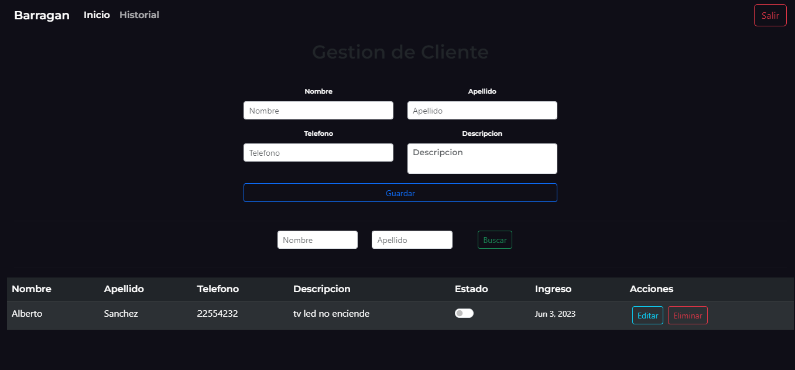

 

# Proyecto de Gestión de Reparaciones de Aparatos Electrónicos.

 

 

## Introduccion.

 

- Este proyecto tiene como objetivo proporcionar una solución eficiente para la gestión de reparaciones de aparatos electrónicos, reemplazando el antiguo sistema basado en papel utilizado por nuestro cliente. Esta aplicación utiliza tecnologías como Spring Boot (con Spring JPA, Spring Security y JWT) en el backend, y Angular (con Bootstrap) en el frontend, para brindar una experiencia de usuario fluida y segura.

 

## Características principales

 

- Registro centralizado:
   
  Todos los electrodomésticos y sus detalles relevantes se almacenan en una base de datos centralizada utilizando Spring JPA.Esto facilita la búsqueda y actualización de información.

* Seguimiento de reparaciones:
   
  Se cuenta con un historial de reparaciones, donde se registra el estado actual, fechas de reparación y cualquier otra información relevante. Esto se logra mediante el uso de las capacidades de persistencia de datos de Spring JPA y la gestión de la base de datos MySQL.

- Autenticación y autorización seguras:
   
  La aplicación utiliza Spring Security para gestionar la autenticación y autorización del usuario. Además, se utiliza JWT (JSON Web Tokens) para asegurar la comunicación segura entre el frontend y el backend.

* Interfaz intuitiva y responsive:
   
  El frontend de la aplicación está desarrollado utilizando Angular, lo que permite ofrecer una interfaz de usuario intuitiva y responsive.

 

## Tecnologías Utilizadas.

 

- Spring Boot 3.0 (Spring JPA | Spring Security)
- Angular (Bootstrap)
- Mysql
- JWT

## Instalación y ejecución

1. Clona este repositorio en tu máquina local.
2. Configura y ejecuta el backend Spring Boot, Abra la carpeta /backend con intelliJ IDEA, espere que las dependencias se instalen.  Luego en el archivo /properties ingrese la configuracion de acceso a su BD (MySql).  Inicie la aplicacion Spring.
3. Configura y ejecuta el frontend Angular. Abra con VSC la carptea /frontend. En VCS abra una ventana de comando, y ejecute - nmp install - se instalaran las dependencias.
4. La base de datos se genera de forma automatica gracias a Spring JPA.
5. En su DB cree de manera manual un usuario Admin.
6. Accede a la aplicación a través de tu navegador web en http://localhost:4200.

## Contribución

- Estamoy abierto a recibir sugerencias, correcciones de errores y nuevas funcionalidades.

## Contacto

- Si tienes alguna pregunta o inquietud relacionada con este proyecto, no dudes en ponerte en contacto con ema9948@gmail.com o https://cristianalbornoz.ml/

¡Gracias por utilizar nuestra aplicación de gestión de reparaciones de aparatos electrónicos! Esperamos que te sea de gran utilidad.

## Features

- Se enviara una notificacion de forma automatica a WhatsApp cuando el electrodomesticos sea reparado.
